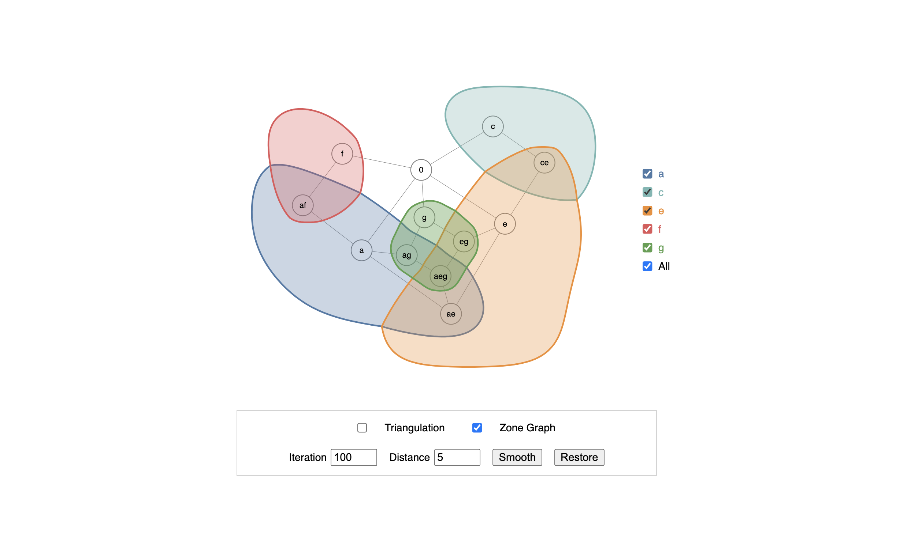

# EulerMerge


This repository comprises two components:

- `embedder`: A Java application for generating simplified, unsmoothed Euler diagrams from abstract descriptions of set systems.
- `smoothEuler`: A Flask project for generating and visualizing smoothed Euler diagrams based on the results obtained from the `embedder`.


Download the source code by running the following command in your terminal:

```
git clone https://github.com/XinyuanRyanYan/EulerMerge.git
```


## embedder (Java)

* **Input**: The abstract description of a set system, which is specified within the `main` method of `embedder/src/euler/simplify/Simplify.java`.

* **Onput**: Running `embedder/src/euler/simplify/Simplify.java` will apply `algorithms 1-5` as described in the paper, and output merge information and JSON files representing the resultant unsmoothed Euler diagram.

## smoothEuler (Flask)
This folder applies the EulerSmooth algorithm and provides tools for visualizing Euler diagrams.

### Dependencies
Before running the project, make sure to install the required Python packages using the following commands:

```
pip install flask
pip install matplotlib
pip install JPype1
pip install networkx
pip install shapely
```

### Running the code
```
cd EulerMerge/smoothEuler
python app.py
```
After running the above commands, you can access the interative visualization demo by visiting http://127.0.0.1:5000/ on the local machine (If possible, please use Chrome). You will see the interface like the one below.



* `Triangulation` allows to visualize the triangulation of the Euler disgram, which indicate how an Euler diagram is derived.
* `Zone graph` allows to visualize the zone graph.
* `Iteration` and `Distance` are parameters of the EulerSmooth algorithm, allowing to control the number of smoothing cycles performed, and the distance between nodes and curves, respectively.
